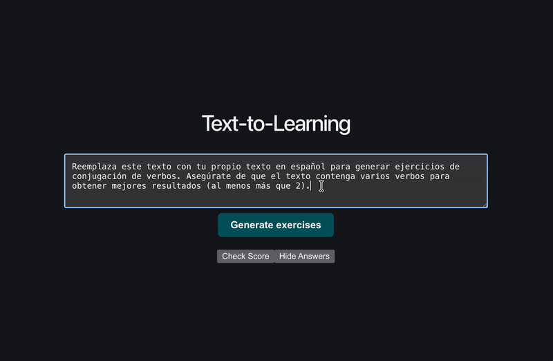

# text-to-learning

Converts foreign-language text into in-context grammar practice for dedicated language learners

Paste existing Spanish text and get back fill-in-the-blank grammar exercises for verb conjugations. The app splits the original text into passages, then takes conjugated verbs in each passage and masks one at random. It shows you only the infinitive, and then it's up to you to determine the proper conjugation

## Current Status
Backend API is working, frontend UI is built out with React and connected, and answer checking is implemented. Next steps: polish UI and produce grammar explanations

## Planning

- [x] Document segmentation and POS tagging
- [x] Passage grouping (preserving passages with insufficient verbs to maks)
- [x] Add exercise generation endpoint
- [x] React frontend 
- [x] Answer checking 
- [ ] Polish UI
- [ ] grammar explanations
